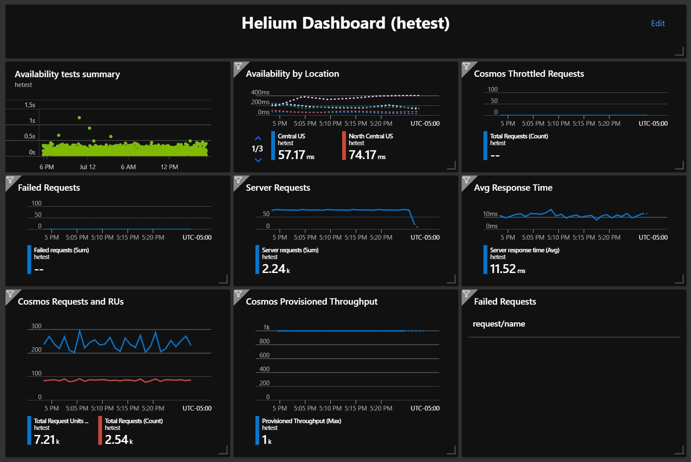

# Web Validate - A web request validation tool


Web Validate (WebV) is a web request validation tool that we use to run end-to-end tests and long-running smoke tests.

## WebV Quick Start

WebV is published as a dotnet package and can be installed as a dotnet global tool. WebV can also be run as a docker container. If you have dotnet core sdk installed, running as a dotnet global tool is the simplest and fastest way to run WebV.

There are many web test tools available. The two main differences with WebV are:

- Integrates into a `single pane of glass`
  - WebV publishes json logs to stdout and stderr
  - WebV publishes the /metrics endpoint for Prometheus
  - This allows you to build a single pane of glass that compares `server errors` with `client errors`
- Deep validation of arbitrary result graphs
  - WebV is primarily designed for json API testing and can perform `deep validation` on arbitrary json graphs

## Running as a dotnet global tool

Install WebV as a dotnet global tool

> WebV is already installed in GitHub Codespaces

```bash

# this allows you to execute WebV from the shell
dotnet tool install -g webvalidate

```

Run a sample validation test against `microsoft.com`

```bash

# change to a directory with WebV test files in it
pushd src/app

# run a test
webv --server https://www.microsoft.com --files msft.json --verbose

```

Run more complex tests against the GitHub API by using:

```bash

# github tests
webv --server https://api.github.com --files github.json --verbose

```

Run a test that fails validation and causes a non-zero exit code

```bash

webv --server https://www.microsoft.com --files failOnValidationError.json --verbose-errors

```

Experiment with WebV

```bash

# get help
webv --help

# change back to the root of the repo
popd

```

## Running as a docker container

Run a sample validation test against `microsoft.com`

```bash

# run the tests from Docker
docker run -it --rm ghcr.io/cse-labs/webvalidate --server https://www.microsoft.com --files msft.json --verbose

```

Run more complex tests against the GitHub API by using:

```bash

# github tests
docker run -it --rm ghcr.io/cse-labs/webvalidate --server https://api.github.com --files github.json --verbose

```

Run a test that fails validation and causes a non-zero exit code

```bash

docker run -it --rm ghcr.io/cse-labs/webvalidate --server https://www.microsoft.com --files failOnValidationError.json --verbose-errors

```

Experiment with WebV

```bash

# get help
docker run -it --rm ghcr.io/cse-labs/webvalidate --help

```

Use your own test files

```bash

# assuming you want to mount MyTestFiles to the containers /app/TestFiles
# this will start bash so you can verify the mount worked correctly
docker run -it --rm -v MyTestFiles:/app/TestFiles --entrypoint bash ghcr.io/cse-labs/webvalidate

# run a test against a local web server running on port 8080 using ~/webv/myTest.json
docker run -it --rm -v MyTestFiles:/app/TestFiles --net=host  ghcr.io/cse-labs/webvalidate --server localhost:8080 --files myTest.json

```

Web Validate uses both environment variables as well as command line options for configuration. Command flags take precedence over environment variables.

Web Validate works in two distinct modes. The default mode processes the input file(s) in sequential order one time and exits. The "run loop" mode runs in a continuous loop until stopped or for the specified duration. Some environment variables and command flags are only valid if run loop is specified and WebV will exit and display usage information. Some parameters have different default values depending on the mode of execution.

## Integration with Application Monitoring

We use `WebV` and [Azure Container Instances](https://azure.microsoft.com/en-us/services/container-instances/) to run geo-distributed, tests against our Web APIs. These tests run 24 x 7 from multiple Azure regions and provide insight into network latency / health as well as service status.

By doing this, not only can we ensure against a [large cloud bill](https://hackernoon.com/how-we-spent-30k-usd-in-firebase-in-less-than-72-hours-307490bd24d), but we can track how cloud usage changes over time and ensure application functionality and performance through integration and load testing.

`Azure Container Instances` integrate with [Azure Monitor](https://azure.microsoft.com/en-us/services/monitor/) to provide out-of-the-box monitoring, dashboards and alerts. Setup instructions, sample queries and sample dashboards are available [here](https://github.com/retaildevcrews/helium/blob/main/docs/AppService.md#smoke-test-setup).

We use the `--log-format json` command line option to integrate Docker container logs with `Azure Log Analytics`. The integration is automatic using `Azure Container Instances`.

### Example Arguments for Long Running Tests

```bash
# continuously send request every 15 seconds
# user defined region, tag and zone to distinguish between WebV instances

--run-loop --sleep 15000 --log-format json --tag my_webv_instance_name --region Central --zone az-central-us

```

### Example Arguments for Load Testing

```bash

# continuously run testing for 60 seconds
# write all results to console as json

--run-loop --verbose --duration 60

# continuously run twice as many tests against microsoft.com
# run testing for 60 seconds
--run-loop --verbose --duration 60 --sleep 500

```

### Example Dashboard



## Command Line Parameters

> Includes short flags and environment variable names where applicable.
>
> Command Line args take precedent over environment variables

- --version
  - other parameters are ignored
  - environment variables are ignored
- --help
  - -h
  - other parameters are ignored
  - environment variables are ignored
- --dry-run bool
  - -d
    - validate parameters but do not execute tests
- --server string1 [string2 string3]
  - -s
  - SERVER
    - server Url (i.e. `https://www.microsoft.com`)
    - `required`
- --files file1 [file2 file3 ...]
  - -f
  - FILES
    - one or more json test files
    - default location current directory
    - `required`
- --base-url string
  - -u
  - BASE_URL
    - base URL and optional path to the test files (http or https)
      - ex: `https://raw.githubusercontent.com/microsoft/webvalidate/main/TestFiles/`
- --delay-start int
  - DELAY_START
    - delay starting the validation test for int seconds
    - default `0`
- --log-format enum
  - LOG_FORMAT
    - format of log items (TsvMin, Tsv, Json, JsonCamel, None)
    - default `TsvMin`
    - LogFormat.None conflicts with --verbose and will throw a parse error
- --max-errors int
  - MAX_ERRORS
    - end test after max-errors
    - if --max-errors is exceeded, WebV will exit with non-zero exit code
    - default `10`
- --region string
  - REGION
    - deployment Region for logging (user defined)
    - default: `null`
- --sleep int
  - -l
  - SLEEP
    - number of milliseconds to sleep between requests
    - default `0`
- --strict-json bool
  - -j
  - STRICT_JSON
    - use strict RFC rules when parsing json
    - json property names are case sensitive
    - exceptions will occur for
      - trailing commas in json arrays
      - comments in json
    - default `false`
- --summary
  - SUMMARY
    - Display test summary (None, Tsv, Json, JsonCamel, Xml)
    - Xml output is in [JUnit](https://llg.cubic.org/docs/junit/) format
    - Xml format summary - Creates a temporary json file (temp.json) to keep the details of test runs which is deleted after each run of webv. Works for RunOnce only.
    - default `None`
- --tag string
  - TAG
    - user defined tag to include in logs and App Insights
      - can be used to identify location, instance, etc.
- --timeout int
  - -t
  - TIMEOUT
    - HTTP request timeout in seconds
    - default `30 sec`
- --verbose bool
  - VERBOSE
    - log 200 and 300 results as well as errors
    - default `false`
- --verbose-errors bool
  - VERBOSE_ERRORS
    - display validation error messages
    - default `false`
- --webv-prefix string
  - WEBV_PREFIX
    - prefix to add to server values that don't begin with http
    - default `https://`
- --webv-suffix string
  - WEBV_SUFFIX
    - suffix to add to server values that don't begin with http
    - default `.azurewebsites.net`
- --zone string
  - ZONE
    - deployment Zone for logging (user defined)
    - default: `null`

### RunLoop Mode Parameters

- Some parameters are only valid if `--run-loop` is specified
- Some parameters have different defaults if `--run-loop` is specified

- --run-loop bool
  - -r
  - RUN_LOOP
    - runs the test in a continuous loop
- --duration int
  - DURATION
    - run test for duration seconds then exit
    - default `0 (run until OS signal)`
- --port int
  - -p
  - PORT
    - Port to use for web endpoints
    - valid: `0 < port < 64K`
    - default: `8080`
- --prometheus bool
  - PROMETHEUS
    - expose the /metrics end point for Prometheus
    - default: `false`
- --random bool
  - RANDOM
    - randomize requests
    - default `false`
- --sleep int
  - -l
  - SLEEP
    - number of milliseconds to sleep between requests
    - default `1000`

## Running as part of an CI-CD pipeline

WebV will return a non-zero exit code (fail) under the following conditions

- Error parsing the test files
- If an unhandled exception is thrown during a test
- StatusCode validation fails
- ContentType validation fails
- --max-errors is exceeded
  - To cause the test to fail on any validation error, set --max-errors 1 (default is 10)
- Any validation error on a test that has FailOnValidationError set to true
- Request timeout

## Validation Files

> Validations are often nested to test the JSON object
>
> We use a simple test file generator to build complex validations

Validation files are located in the /app/TestFiles directory and are json files that control the validation tests.

You can mount a local volume into the Docker container at /app/TestFiles to test your files against your server if you don't want to rebuild the container

- HTTP redirects are not followed
- All string comparisons are case sensitive

- Path (required)
  - path to resource (do not include http or dns name)
  - valid: must begin with /
- Verb
  - default: GET
  - valid: HTTP verbs
- Tag
  - default: string.empty
  - tag for the request
    - this will override the --tag value for that request
- FailOnValidationError (optional)
  - If true, any validation error will cause that test to fail
  - default: false
- Validation (optional)
  - if not specified in test file, no validation checks will run
  - StatusCode
    - required
    - http status code
    - a validation error will cause the test to fail and return a non-zero error code
    - no other validation checks are executed
    - default: 200
    - valid: 100-599
  - ContentType
    - required
    - http Content-Type header
    - a validation error will cause the test to fail and return a non-zero error code
    - no other validation checks are executed
    - default: application/json
    - valid: valid MIME type
  - Length
    - length of content
      - cannot be combined with MinLength or MaxLength
    - valid: null or >= 0
  - MinLength
    - minimum content length
    - valid: null or >= 0
  - MaxLength
    - maximum content length
    - valid: null or > MinLength
    - valid: if MinLength == null >= 0
  - MaxMilliSeconds
    - maximum duration in ms
    - valid: null or > 0
  - ExactMatch
    - Body exactly matches value
    - valid: non-empty string
  - Contains[string]
    - case sensitive string "contains"
    - string
      - valid: non-empty string
  - JsonArray
    - valid: parses into json array
    - Count
      - exact number of items
      - Valid: >= 0
      - valid: cannot be combined with MinCount or MaxCount
    - MinCount
      - minimum number of items
      - valid: >= 0
        - can be combined with MaxCount
    - MaxCount
      - maximum number of items
      - valid: > MinCount
        - can be combined with MinCount
    - ByIndex[JsonObject]
      - checks a json object in the array by index
      - JsonObject[]
        - validates object[index]
        - Index
          - Index of object to check
          - valid: >= 0
        - JsonObject
          - JsonObject definition to check
          - valid: JsonObject rules
    - ForAny[JsonObject]
      - checks each json object in the array until it finds a valid item
      - JsonObject[]
        - JsonObject
          - JsonObject definition to check
          - valid: JsonObject rules
    - ForEach[JsonObject]
      - checks each json object in the array
      - JsonObject[]
        - JsonObject
          - JsonObject definition to check
          - valid: JsonObject rules
  - JsonObject[]
    - valid: parses into json object
    - Field
      - name of field
      - valid: non-empty string
    - Value (optional)
      - if not specified, verifies the Field exists in the json document
      - valid: null, number or string
    - Validation (optional)
      - validation object to execute (for json objects within objects)
      - valid: null or valid json
- PerfTarget (optional)
  - Category
    - used to group requests into categories for reporting
    - valid: non-empty string
  - Targets[3]
    - maximum quartile value in ascending order
    - example: [ 100, 200, 400 ]
      - Quartile 1 <= 100 ms
      - Quartile 2 <= 200 ms
      - Quartile 3 <= 400 ms
      - Quartile 4 > 400 ms

## Environment Variable Substitutions

WebV can substitute environment variable values in the test file(s).

- Define the environment variable substitutions in the `Variables` json array
- Include the `${VARIABLE_NAME}` in the test file(s)
- If one or more environment variables are not set, WebV will substitute with `empty string` which could cause validation errors
- The comparison is `case sensitive`

```bash

# set the environment variables
export ROBOTS=robots.txt
export FAVICON=favicon.ico

# run the test
webv -s https://www.microsoft.com --files envvars.json

```

> JSON sample using environment variable substitution

```json

{
  "variables": [ "ROBOTS", "FAVICON" ],
  "requests": [
    {
      "path": "/${ROBOTS}",
      "validation": { "contentType": "text/plain" }
    },
    {
      "path": "/${FAVICON}",
      "validation": { "contentType": "image/x-icon" }
    }
  ]
}

```

## Sample `microsoft.com` validation tests

The msft.json file contains sample validation tests that will will successfully run against the `microsoft.com` endpoint (assuming content hasn't changed)

- note that http status codes are not specified when 200 is expected
- note that ContentType is not specified when the default of application/json is expected

### Redirect from home page

- Note that redirects are not followed

```json

{
  "path":"/",
  "validation": { "statusCode":302 }
}

```

### home page (en-us)

```json

{
  "path":"/en-us",
  "validation":
  {"
    contentType":"text/html",
    "contains":
    [
      { "value":"<title>Microsoft - Official Home Page</title>" },
      { "value":"<head data-info=\"{" }
    ]
  }
}

```

### favicon

```json

{
  "path": "/favicon.ico",
  "validation":
  {
    "contentType":"image/x-icon"
  }
}

```

### robots.txt

```json

{
  "path": "/robots.txt",
  "validation":
  {
    "contentType": "text/plain",
    "minLength": 200,
    "contains":
    [
      { "value": "User-agent: *" },
      { "value": "Disallow: /en-us/windows/si/matrix.html"}
    ]
  }
}

```

## Sample GitHub tests

### Array of Repositories

```json

{
  "path": "/orgs/octokit/repos",
  "validation": {
    "contentType": "application/json",
    "jsonArray": {
      "count": 30,
      "forEach": [
        {
          "jsonObject": [
            { "field": "id" },
            { "field": "node_id" },
            { "field": "name" },
            { "field": "full_name" },
            { "field": "private" },
            {
              "field": "owner",
              "validation": {
                "jsonObject": [
                  { "field": "login" },
                  { "field": "id" },
                  { "field": "node_id" },
                  { "field": "avatar_url" },
                  { "field": "gravatar_id" },
                  { "field": "url" },
                  { "field": "html_url" },
                  { "field": "followers_url" },
                  { "field": "following_url" },
                  { "field": "gists_url" },
                  { "field": "starred_url" },
                  { "field": "subscriptions_url" },
                  { "field": "organizations_url" },
                  { "field": "repos_url" },
                  { "field": "events_url" },
                  { "field": "received_events_url" },
                  { "field": "type" },
                  { "field": "site_admin" }
                ]
              }
            }
          ]
        }
      ]
    }
  }
}

```

### Single Repository Validation

```json

{
  "path": "/repos/octokit/octokit.net",
  "validation": {
    "contentType": "application/json",
    "jsonObject": [
      {
        "field": "id",
        "value": 7528679
      },
      {
        "field": "name",
        "value": "octokit.net"
      },
      {
        "field": "owner",
        "validation": {
          "jsonObject": [
            {
              "field": "login",
              "value": "octokit"
            },
            {
              "field": "id",
              "value": 3430433
            },
            {
              "field": "url",
              "value": "https://api.github.com/users/octokit"
            },
            {
              "field": "html_url",
              "value": "https://github.com/octokit"
            },
            {
              "field": "type",
              "value": "Organization"
            }
          ]
        }
      },
      {
        "field": "html_url",
        "value": "https://github.com/octokit/octokit.net"
      }
    ]
  }
}

```

## Deprecation Warnings

> Breaking changes in v2.2

- The Docker repo is `ghcr.io/cse-labs/webvalidate`

> Breaking changes in v2.0

- The Docker repo is `ghcr.io/cse-labs/webvalidate`
- This release requires `dotnet 5.0`
- `--json-log` was removed
  - use `--log-format json` or `--log-format jsonCamel` instead
- `--summary-minutes` was removed
  - use some type of log to store and summarize the results
- `--max-concurrent` was removed
  - use `--sleep` and `--timeout` to control connections
- `--verbose` always defaults to `false`
- Test files require the current `json format`

  ```json

  {
    "requests":
    [
      {"path": ...}
      {"path": ...}
    ]
  }

  ```

## Contributing

This project welcomes contributions and suggestions. Most contributions require you to agree to a
Contributor License Agreement (CLA) declaring that you have the right to, and actually do, grant us
the rights to use your contribution. For details, visit [Microsoft Contributor License Agreement](https://cla.opensource.microsoft.com).

When you submit a pull request, a CLA bot will automatically determine whether you need to provide
a CLA and decorate the PR appropriately (e.g., status check, comment). Simply follow the instructions
provided by the bot. You will only need to do this once across all repos using our CLA.

This project has adopted the [Microsoft Open Source Code of Conduct](https://opensource.microsoft.com/codeofconduct/).
For more information see the [Code of Conduct FAQ](https://opensource.microsoft.com/codeofconduct/faq/) or
contact [opencode@microsoft.com](mailto:opencode@microsoft.com) with any additional questions or comments.

## Trademarks

This project may contain trademarks or logos for projects, products, or services.

Authorized use of Microsoft trademarks or logos is subject to and must follow [Microsoft's Trademark & Brand Guidelines](https://www.microsoft.com/en-us/legal/intellectualproperty/trademarks/usage/general).

Use of Microsoft trademarks or logos in modified versions of this project must not cause confusion or imply Microsoft sponsorship.

Any use of third-party trademarks or logos are subject to those third-party's policies.
