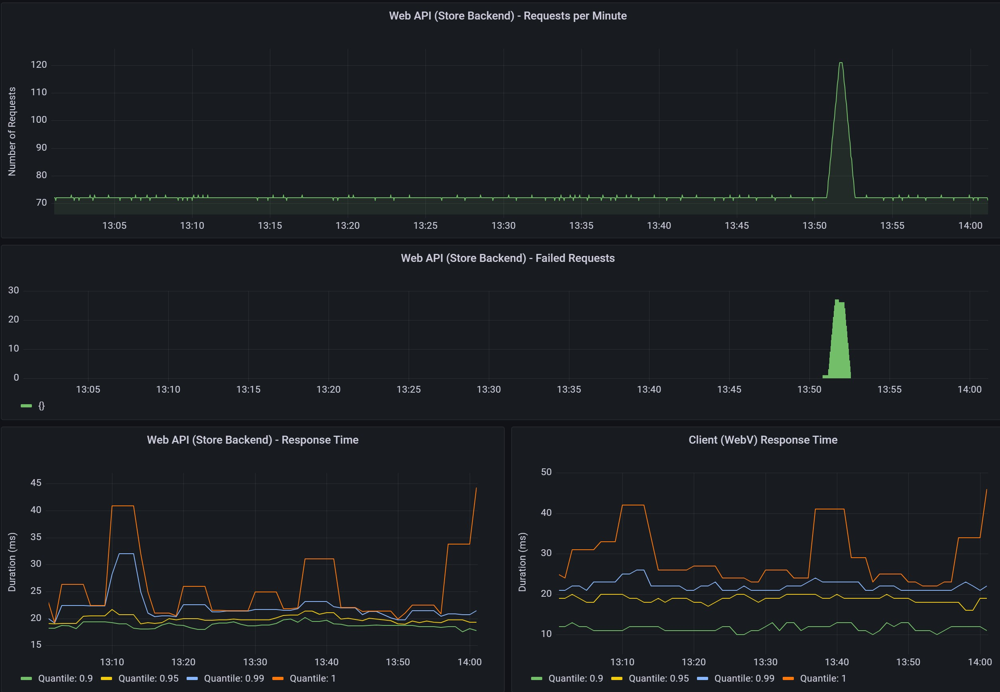

# Integration with Application Monitoring

WebV can be configured to run extensive and continuous testing on Web APIs.

## Example Arguments for Testing in Production

```bash
# continuously send a request every 15 seconds
# user defined region, tag and zone to distinguish between application instances

--run-loop --verbose --sleep 15000 --log-format json --tag my_webv_instance_name --region Central --zone az-central-us

```

## Example Arguments for Load Testing

```bash

# continuously run testing for 60 seconds
# sleep between each request is 10ms (approx 100 RPS)
# write all results to console as json

--run-loop --verbose --sleep 10 --duration 60 --log-format Json

# continuously run twice as many tests against microsoft.com
# run testing for 60 seconds
--run-loop --verbose --duration 60 --sleep 500

```

## Scaling Tests

Because WebV integrates with your existing log forwarding and Prometheus infrastructure, you can deploy multiple WebV instances across geos and get all results in your single pane of glass.

- The deeper the WebV validation, the more processing required
- WebV will run up to as fast as configured within processor, memory and network limitations

You can run the same test on multiple threads by specifying the server(s) multiple times

```bash

# run two WebV threads in one instance
-- server microsoft.com microsoft.com

# run six WebV threads in one instance
# three threads on each server
-- server microsoft.com microsoft.com microsoft.com bing.com bing.com bing.com

```

## Example Dashboard (Grafana)


